<div align="center">


</div>

## Why

Most README tools give you text and shields.io badges, or generic AI banner art that could belong to any project — never a real hero. The gap is a **top-of-README hero that shows what your project _is_**, built from its real name, purpose, and tech, and that actually renders and animates on GitHub. That's the whole job of this skill.

## Examples

<p align="center">
  <a href="https://github.com/jmoraispk/odysseus-fx">
    
  </a>
</p>

<p align="center">
  <a href="https://github.com/jmoraispk/delta-review">
    
  </a>
</p>

<p align="center">
  <a href="https://github.com/jmoraispk/codeaway">
    
  </a>
</p>

…and **20 more in the wild** — check the **[wild gallery](assets/wild/wild.md)**.

|   |   |
|:--:|:--:|
| <a href="https://github.com/Genymobile/scrcpy"></a><br>**scrcpy** · ⭐ 146k | <a href="https://github.com/d3/d3"></a><br>**d3** · ⭐ 110k |
| <a href="https://github.com/axios/axios"></a><br>**axios** · ⭐ 107k | <a href="https://github.com/mrdoob/three.js"></a><br>**three.js** · ⭐ 103k |
| <a href="https://github.com/excalidraw/excalidraw"></a><br>**excalidraw** · ⭐ 90k | <a href="https://github.com/jesseduffield/lazygit"></a><br>**lazygit** · ⭐ 80k |
| <a href="https://github.com/mermaid-js/mermaid"></a><br>**mermaid** · ⭐ 79k | <a href="https://github.com/chartjs/Chart.js"></a><br>**Chart.js** · ⭐ 65k |
| <a href="https://github.com/tesseract-ocr/tesseract"></a><br>**tesseract** · ⭐ 63k | <a href="https://github.com/socketio/socket.io"></a><br>**socket.io** · ⭐ 61k |
| <a href="https://github.com/Leaflet/Leaflet"></a><br>**Leaflet** · ⭐ 42k | <a href="https://github.com/date-fns/date-fns"></a><br>**date-fns** · ⭐ 34k |
| <a href="https://github.com/lovell/sharp"></a><br>**sharp** · ⭐ 30k | <a href="https://github.com/sharkdp/hyperfine"></a><br>**hyperfine** · ⭐ 28k |
| <a href="https://github.com/liabru/matter-js"></a><br>**matter-js** · ⭐ 17k | <a href="https://github.com/catppuccin/catppuccin"></a><br>**catppuccin** · ⭐ 15k |
| <a href="https://github.com/asciinema/asciinema"></a><br>**asciinema** · ⭐ 15k | <a href="https://github.com/katspaugh/wavesurfer.js"></a><br>**wavesurfer.js** · ⭐ 9.0k |
| <a href="https://github.com/ImageOptim/gifski"></a><br>**gifski** · ⭐ 7.0k | <a href="https://github.com/nayuki/QR-Code-generator"></a><br>**QR-Code-generator** · ⭐ 5.0k |

## How to use

**1. Install it.** As a Claude Code plugin (recommended):

```bash
/plugin marketplace add jmoraispk/hero-readme
/plugin install hero-readme@hero-readme
```

For any other agent, copy [`skills/hero-readme/`](skills/hero-readme) into its skills directory (commonly `.agents/skills/`).

**2. Ask for a hero** — point your agent at a repo:

> **You:** *"make an image for the top of the README"*

It also triggers on *"add a hero/banner to my README"* or *"make my README look better."*

**3. It reads your project and sketches a direction.** Because every hero is built from your real name, tagline, and tech, the skill can take it different ways — here, the same project as a wordmark, an aurora, and a terminal:

<p align="center">
  
  
  
</p>

It then **renders and independently reviews** the result — watching several animation frames for alignment, motion, and legibility — revises until it passes, commits the SVG to `assets/`, and wires it into your README. For fun, more animated marketing motifs live in the **[concept lab](assets/concept-lab.md)**.

<details>
<summary><b>How it works</b> — the pipeline, for the curious</summary>

<br>

1. **Gather real signals** — name, tagline, project type, language, core features, existing brand.
2. **Pick an authentic motif** — a background, palette, and animation that depict what the project does; never a shared template.
3. **Compose a dark banner with a required background effect** — flow-field, particles, aurora, plasma, and more, colored from the project palette, under a scrim so text stays legible.
4. **Build the SVG to GitHub's real constraints** — no `<script>` or `:hover` (GitHub loads it as an ``), animate with SMIL / CSS `@keyframes`, gate motion behind `prefers-reduced-motion`, add accessibility metadata.
5. **Review and revise, independently** — a separate reviewer renders several animation frames and critiques them; the author revises until it passes. SVG defects are invisible in the code and obvious once watched, so a hero is never shipped unlooked-at.
6. **Wire it into the README** with honest copy — no invented badges or features.

The differentiators: naive SVG generators assume `<script>` runs (so their "animated" heroes are static or broken on GitHub — see [`github-svg-constraints.md`](skills/hero-readme/references/github-svg-constraints.md)), and they never watch what they produced (so it's misaligned or generic — hence the review loop).

</details>
