<div align="center">


# hero-readme

**A Claude skill that generates an authentic, animated SVG hero for your README — derived from what your project actually is, not generic AI art.**

</div>

## Why

Most "README" tools land in one of two camps, and neither gives you a real hero:

- **Doc writers** emit text and shields.io badges. Their own docs admit they *"cannot include screenshots."* No hero.
- **Banner generators** produce generic AI art or abstract SVG logos that could belong to any project.

The gap is a **top-of-README hero that shows what this project _is_** — built from real signals (its name, purpose, tech, architecture), and that actually renders and animates on GitHub. That's the whole job of this skill.

> The hero at the top of this README was generated by the skill, for the skill. It's the document motif *because that's literally what the tool does*: put an animated hero on top of a README — over a live flow-field background.

## Examples

Self-contained dark banners with a **live background effect** and a motif drawn from what each project actually is.

**Generated by this skill:**

<p align="center">
  <a href="https://github.com/jmoraispk/codeaway">
    
  </a>
</p>

[**codeaway**](https://github.com/jmoraispk/codeaway) — a targeting reticle locks onto an action button while a cursor clicks it, the way codeaway detects and clicks to keep AI agents running; the green palette comes from its "running" status dot.

**The bar this skill is modeled on** (hand-built by their authors for their own repos):

<p align="center">
  <a href="https://github.com/jmoraispk/odysseus-fx">
    
  </a>
</p>

<p align="center">
  <a href="https://github.com/jmoraispk/delta-review">
    
  </a>
</p>

[**odysseus-fx**](https://github.com/jmoraispk/odysseus-fx) — a flow-field particle background that mirrors the project's own effects gallery. [**delta-review**](https://github.com/jmoraispk/delta-review) — a twinkling dot-grid with a live code-diff motif. All animate on GitHub with no `<script>`.

## Install

**As a Claude Code plugin (recommended):**

```bash
/plugin marketplace add jmoraispk/hero-readme
```

```bash
/plugin install hero-readme@hero-readme
```

**As a plain skill (any agent):** copy [`skills/hero-readme/`](skills/hero-readme) into your agent's skills directory (for Claude Code, `~/.claude/skills/`).

## Use

Point your agent at a repo and ask:

> "Give this README a beautiful hero image."

The skill triggers on requests like *"make my README beautiful,"* *"add a hero/banner,"* or *"generate a project banner."* It then commits an SVG to `assets/` and wires it into the README.

## How it works

1. **Gather real signals** — name, tagline, project type, language, core features, existing brand.
2. **Pick one authentic archetype** — wordmark, concept-motif, or architecture/flow.
3. **Compose a dark banner with a required background effect** — flow-field, particles, aurora, or plasma, colored from the project palette, under a scrim so text stays legible.
4. **Build the SVG to GitHub's real constraints** — no `<script>` or `:hover` (GitHub loads it as an ``), animate with SMIL / CSS `@keyframes`, gate motion behind `prefers-reduced-motion`, add accessibility metadata.
5. **Render and self-review** — the SVG is rendered and critiqued for alignment, overlap, spacing, and legibility, then fixed and re-rendered until clean. SVG coordinates are easy to get subtly wrong, so a hero is never shipped unlooked-at.
6. **Wire it into the README** with honest copy — no invented badges or features.

Two things make the output good: naive SVG generators assume `<script>` runs (so their "animated" heroes are static or broken on GitHub — see [`github-svg-constraints.md`](skills/hero-readme/references/github-svg-constraints.md)), and they never look at what they produced (so it's misaligned — hence the self-review loop).

## What's in the box

```
skills/hero-readme/
├── SKILL.md                              # workflow + the self-review loop
└── references/
    ├── github-svg-constraints.md         # what actually animates on GitHub
    ├── background-effects.md             # flow-field / particles / aurora / plasma
    ├── hero-design.md                    # deriving palette/type/motion from real signals
    └── readme-structure.md               # honest README skeleton
assets/hero.svg                           # this repo's own hero (dogfooded)
assets/examples/                          # the example banners above
.claude-plugin/                           # plugin + marketplace manifests
```

## The principle

**Authenticity.** Every visual element must trace back to a real signal from the repo. If you can't name where a shape, word, or color came from, it doesn't belong. Generic-but-pretty art is exactly the failure this skill exists to prevent.

## License

MIT — see [LICENSE](LICENSE).
