# hero-readme — in the wild

A **bespoke, brand-colored, concept-matched** set for **103 popular repositories**. Each repo's README was analyzed by an agent (which chose the brand palette, tagline, and a concept motif), then rendered by hero-readme. Per repo: a **hero** plus three marketing motifs — **before → after**, **boot-up**, and **side-by-side** — all animating on GitHub with no `<script>`.

> Agent-designed, generator-built. Brand colors and "concept motif" are the agent's best read of each project. Sorted by stars.

---

### [Genymobile/scrcpy](https://github.com/Genymobile/scrcpy) · ⭐ 146k · `C`

Display and control your Android device

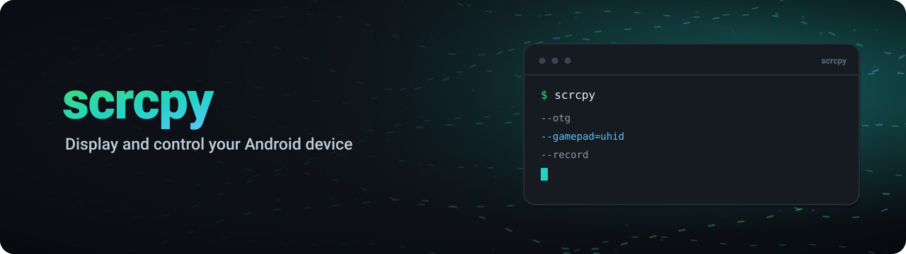

&nbsp;&nbsp;

---

### [axios/axios](https://github.com/axios/axios) · ⭐ 109k · `JavaScript`

Promise based HTTP client for the browser and node.js

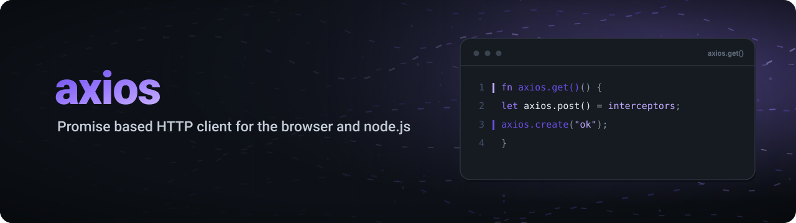

&nbsp;&nbsp;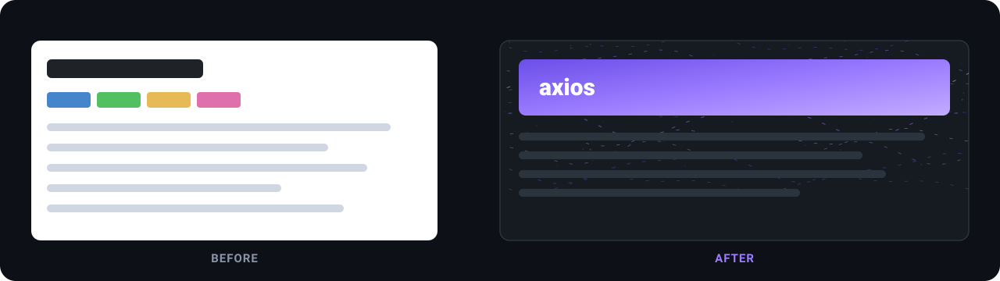

---

### [nvbn/thefuck](https://github.com/nvbn/thefuck) · ⭐ 98k · `Python`

Corrects errors in your previous console command.

&nbsp;&nbsp;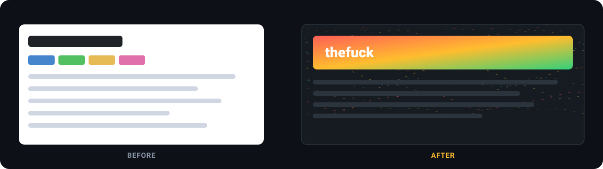

---

### [junegunn/fzf](https://github.com/junegunn/fzf) · ⭐ 82k · `Go`

A command-line fuzzy finder

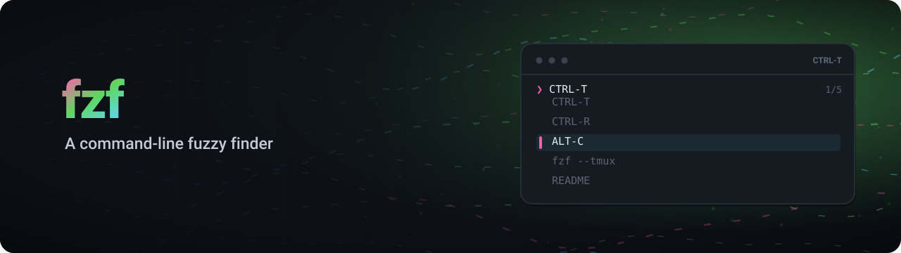

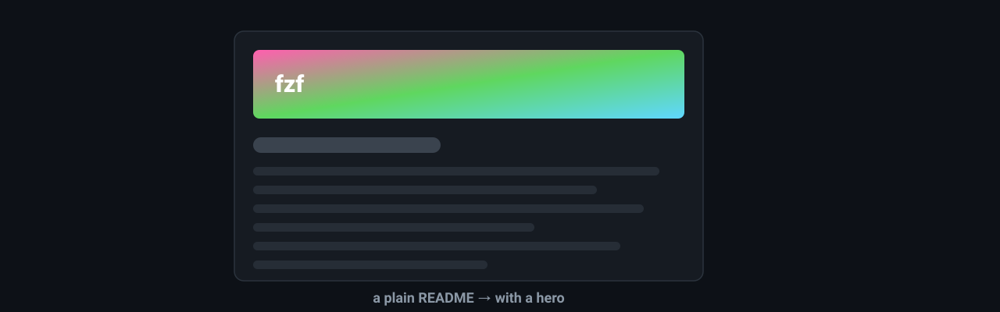&nbsp;&nbsp;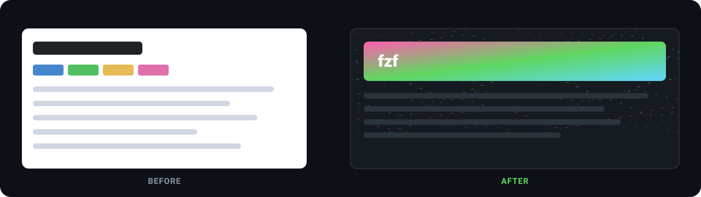

---

### [jesseduffield/lazygit](https://github.com/jesseduffield/lazygit) · ⭐ 81k · `Go`

Simple terminal UI for git commands

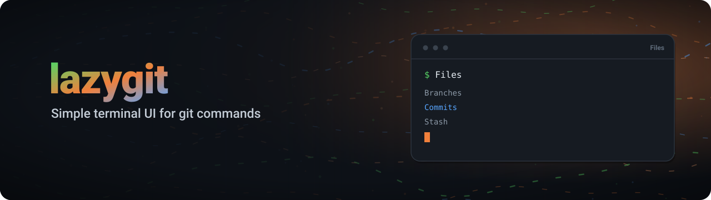

&nbsp;&nbsp;

---

### [BurntSushi/ripgrep](https://github.com/BurntSushi/ripgrep) · ⭐ 66k · `Rust`

Recursively search directories for a regex pattern

&nbsp;&nbsp;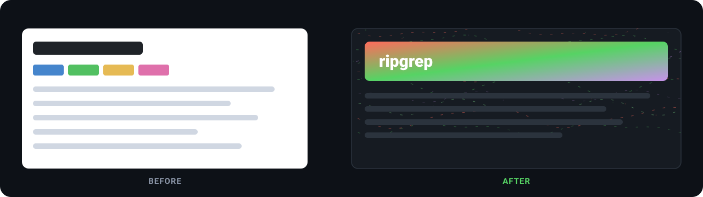

---

### [tldr-pages/tldr](https://github.com/tldr-pages/tldr) · ⭐ 63k · `Markdown`

Collaborative cheatsheets for console commands

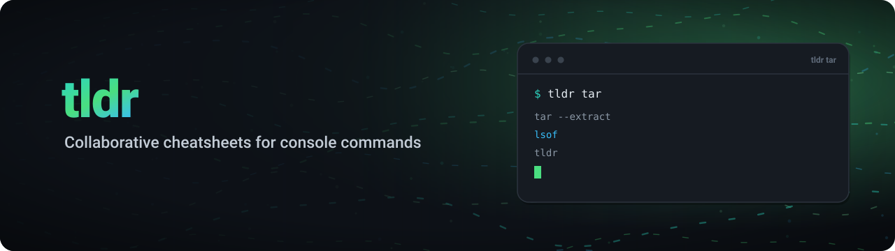

&nbsp;&nbsp;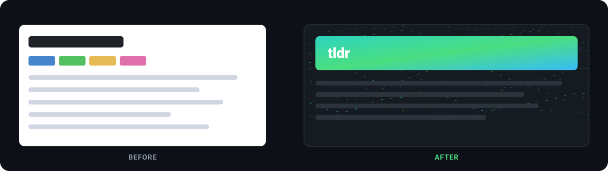

---

### [lodash/lodash](https://github.com/lodash/lodash) · ⭐ 61k · `JavaScript`

A modern JavaScript utility library

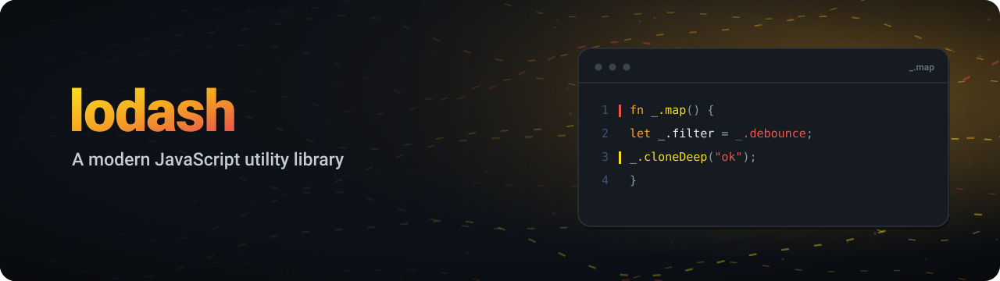

&nbsp;&nbsp;

---

### [sharkdp/bat](https://github.com/sharkdp/bat) · ⭐ 60k · `Rust`

A cat(1) clone with wings.

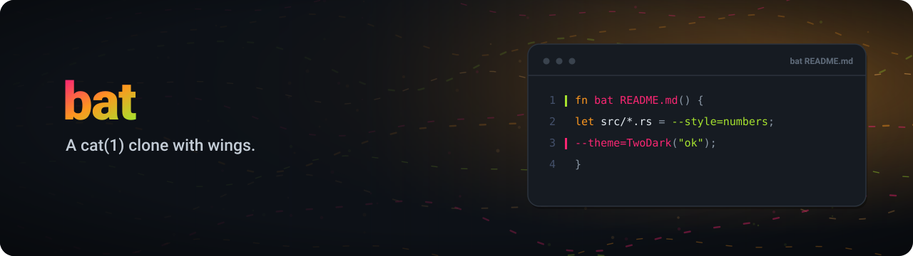

&nbsp;&nbsp;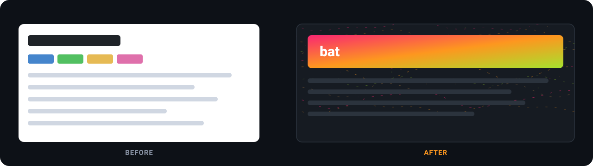

---

### [starship/starship](https://github.com/starship/starship) · ⭐ 59k · `Rust`

The minimal, blazing-fast, customizable shell prompt

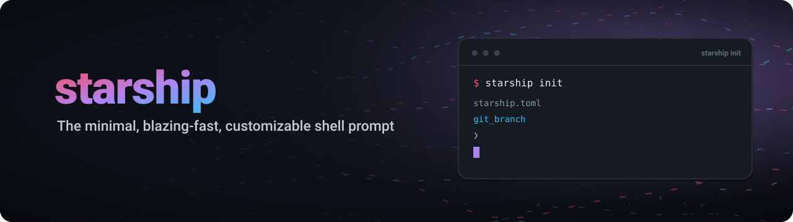

&nbsp;&nbsp;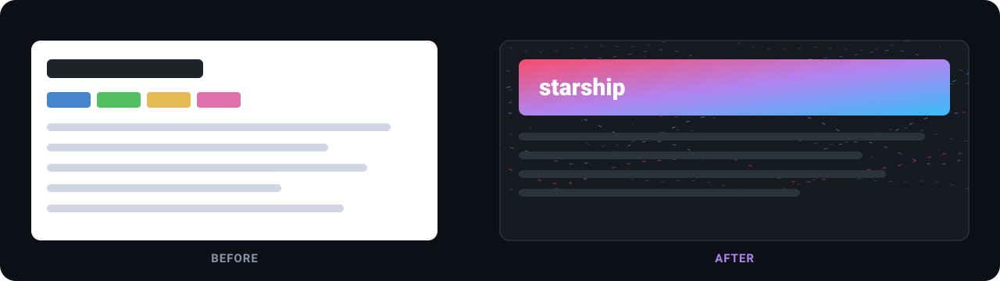

---

### [wagoodman/dive](https://github.com/wagoodman/dive) · ⭐ 54k · `Go`

Explore each layer in a Docker image

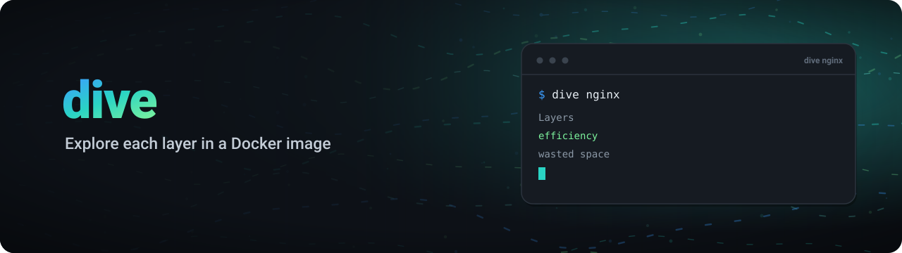

&nbsp;&nbsp;

---

### [psf/requests](https://github.com/psf/requests) · ⭐ 54k · `Python`

A simple, yet elegant, HTTP library.

&nbsp;&nbsp;

---

### [jesseduffield/lazydocker](https://github.com/jesseduffield/lazydocker) · ⭐ 52k · `Go`

The lazier way to manage everything docker

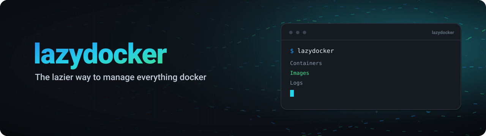

&nbsp;&nbsp;

---

### [nlohmann/json](https://github.com/nlohmann/json) · ⭐ 50k · `C++`

JSON for Modern C++

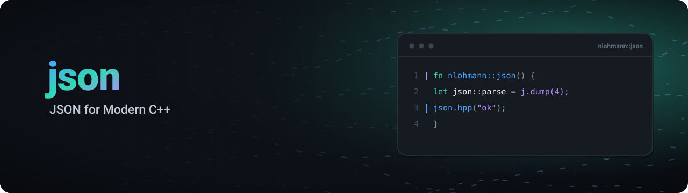

&nbsp;&nbsp;

---

### [tmux/tmux](https://github.com/tmux/tmux) · ⭐ 48k · `C`

A terminal multiplexer: many terminals, one screen.

&nbsp;&nbsp;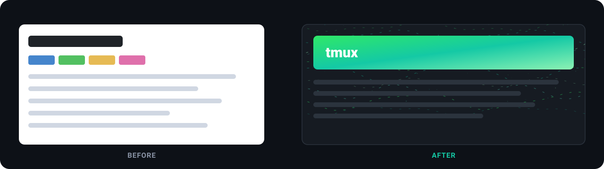

---

### [pyenv/pyenv](https://github.com/pyenv/pyenv) · ⭐ 45k · `Shell`

Simple Python version management

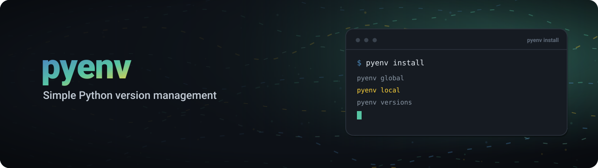

&nbsp;&nbsp;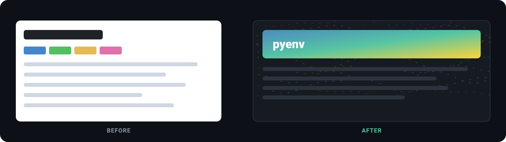

---

### [spf13/cobra](https://github.com/spf13/cobra) · ⭐ 44k · `Go`

A library for creating powerful modern CLI apps.

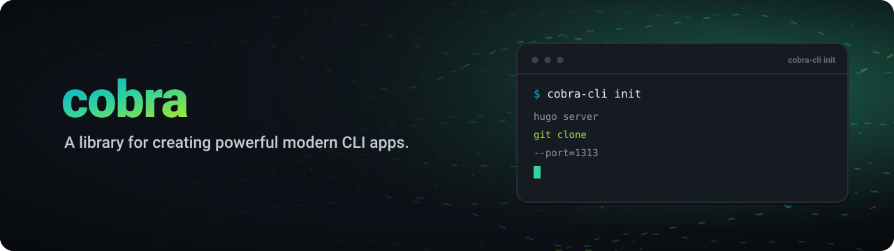

&nbsp;&nbsp;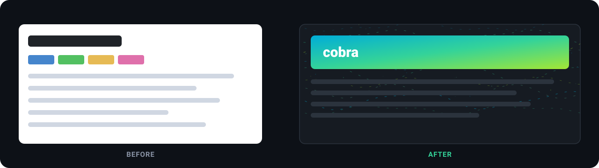

---

### [sharkdp/fd](https://github.com/sharkdp/fd) · ⭐ 44k · `Rust`

A fast, user-friendly alternative to 'find'

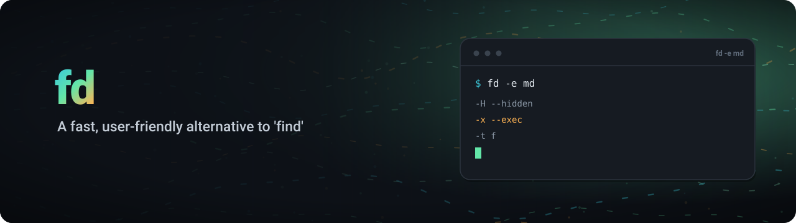

&nbsp;&nbsp;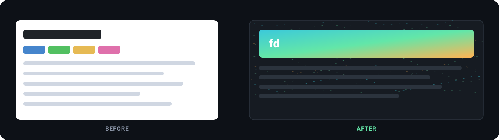

---

### [curl/curl](https://github.com/curl/curl) · ⭐ 42k · `C`

Transfer data to or from a server, using URLs

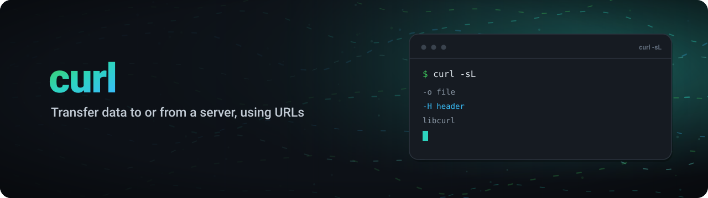

&nbsp;&nbsp;

---

### [psf/black](https://github.com/psf/black) · ⭐ 42k · `Python`

The uncompromising Python code formatter

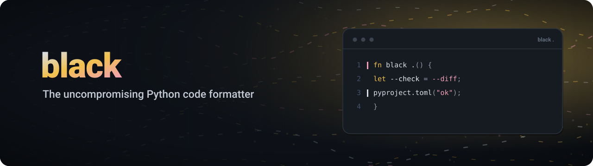

&nbsp;&nbsp;

---

### [koalaman/shellcheck](https://github.com/koalaman/shellcheck) · ⭐ 40k · `Haskell`

A shell script static analysis tool

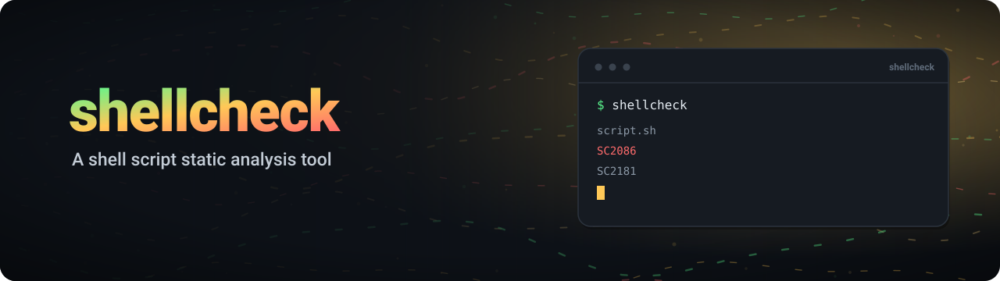

&nbsp;&nbsp;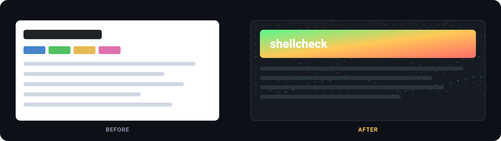

---

### [google/googletest](https://github.com/google/googletest) · ⭐ 39k · `C++`

Google's C++ testing and mocking framework

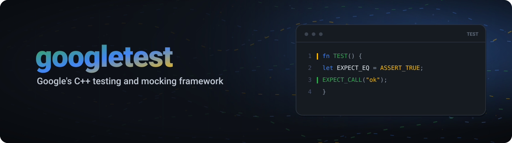

&nbsp;&nbsp;

---

### [ajeetdsouza/zoxide](https://github.com/ajeetdsouza/zoxide) · ⭐ 38k · `Rust`

A smarter cd command. Supports all major shells.

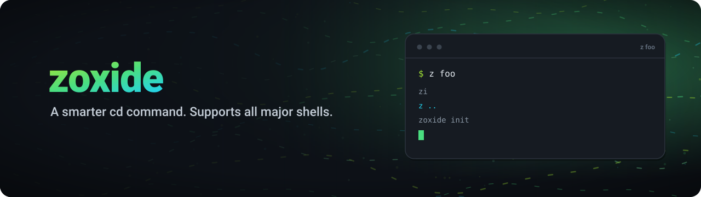

&nbsp;&nbsp;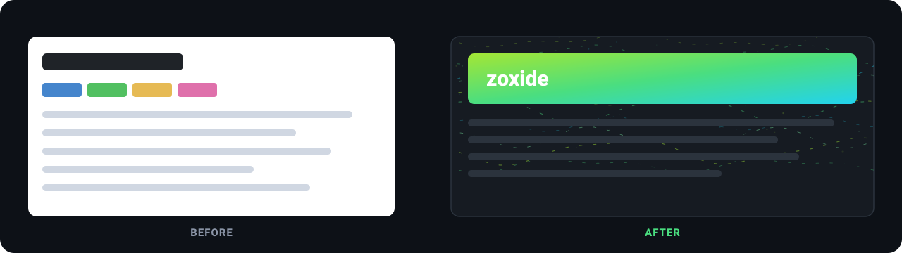

---

### [date-fns/date-fns](https://github.com/date-fns/date-fns) · ⭐ 37k · `TypeScript`

Modern JavaScript date utility library

&nbsp;&nbsp;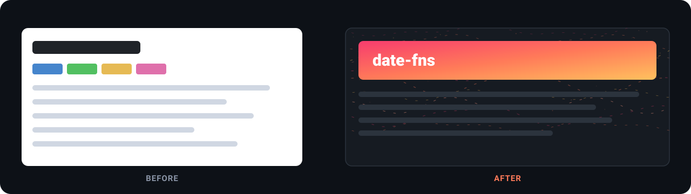

---

### [koajs/koa](https://github.com/koajs/koa) · ⭐ 36k · `JavaScript`

Expressive async middleware for Node.js

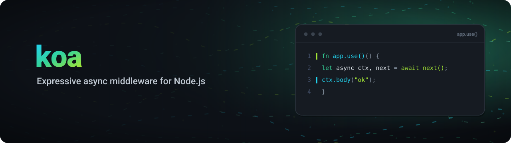

&nbsp;&nbsp;

---

### [jqlang/jq](https://github.com/jqlang/jq) · ⭐ 35k · `C`

Command-line JSON processor

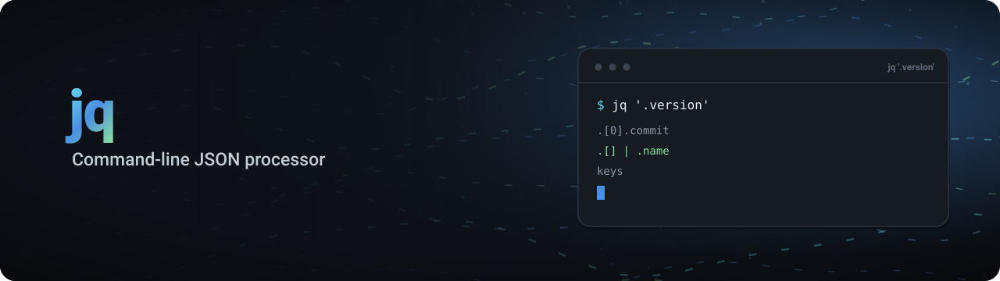

&nbsp;&nbsp;

---

### [casey/just](https://github.com/casey/just) · ⭐ 35k · `Rust`

Save and run project-specific commands.

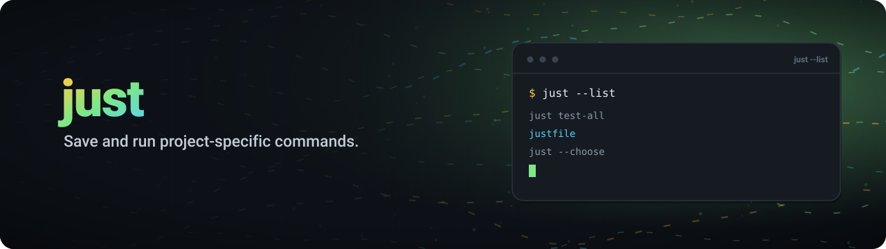

&nbsp;&nbsp;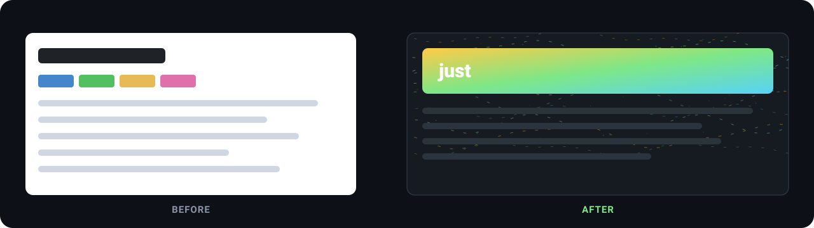

---

### [python-poetry/poetry](https://github.com/python-poetry/poetry) · ⭐ 34k · `Python`

Python packaging and dependency management made easy

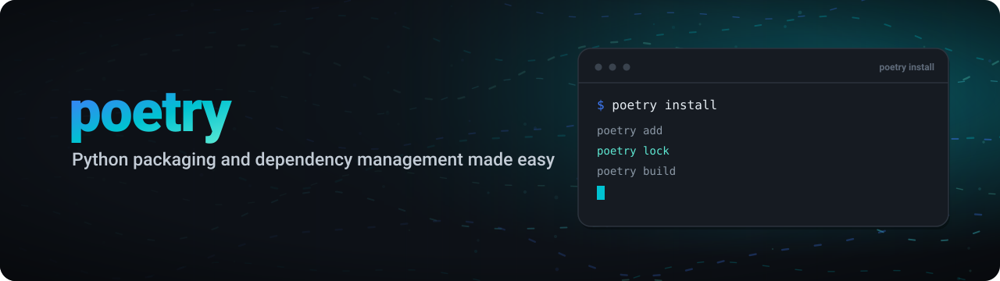

&nbsp;&nbsp;

---

### [derailed/k9s](https://github.com/derailed/k9s) · ⭐ 34k · `Go`

Kubernetes CLI to manage your clusters in style

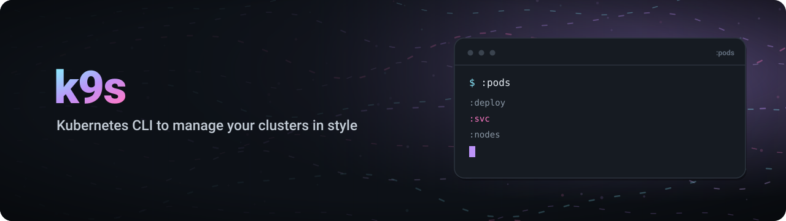

&nbsp;&nbsp;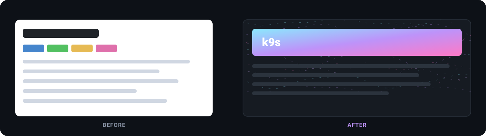

---

### [aristocratos/btop](https://github.com/aristocratos/btop) · ⭐ 34k · `C++`

Resource monitor for CPU, memory, disks &amp; network

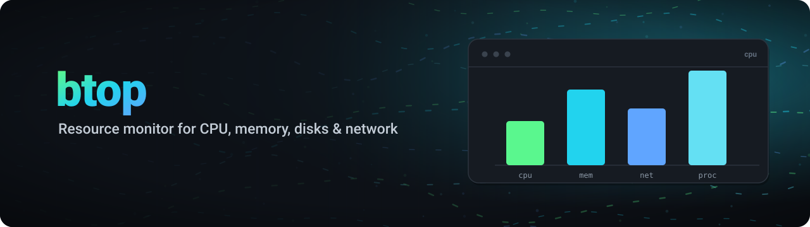

&nbsp;&nbsp;

---

### [dandavison/delta](https://github.com/dandavison/delta) · ⭐ 32k · `Rust`

A syntax-highlighting pager for git, diff, and grep output

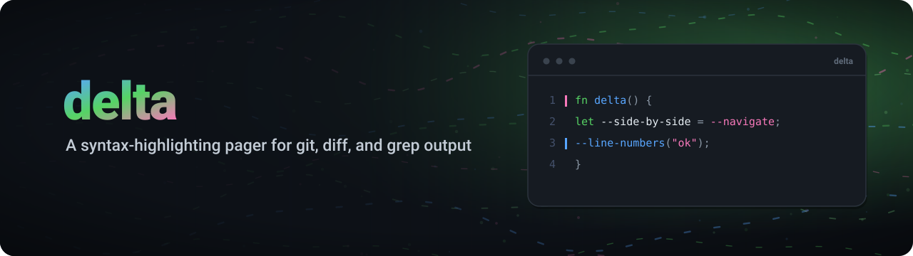

&nbsp;&nbsp;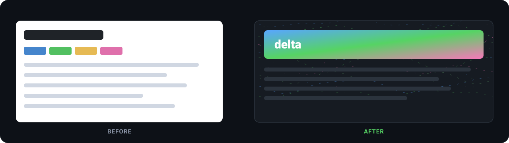

---

### [tqdm/tqdm](https://github.com/tqdm/tqdm) · ⭐ 31k · `Python`

A fast, extensible progress bar for Python and CLI

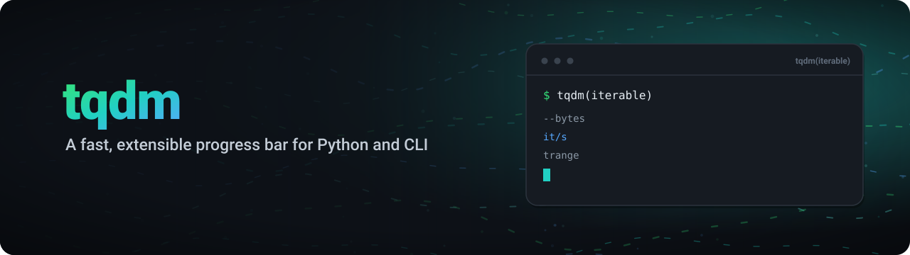

&nbsp;&nbsp;

---

### [spf13/viper](https://github.com/spf13/viper) · ⭐ 30k · `Go`

Go configuration with fangs

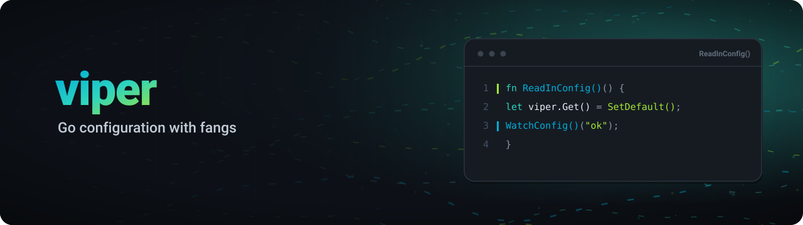

&nbsp;&nbsp;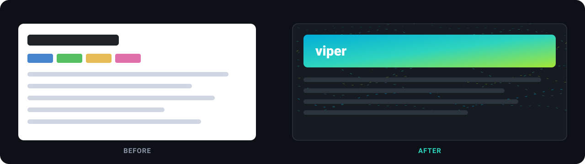

---

### [gabime/spdlog](https://github.com/gabime/spdlog) · ⭐ 29k · `C++`

Fast C++ logging library

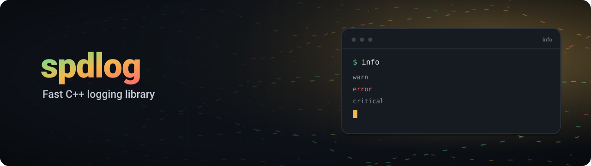

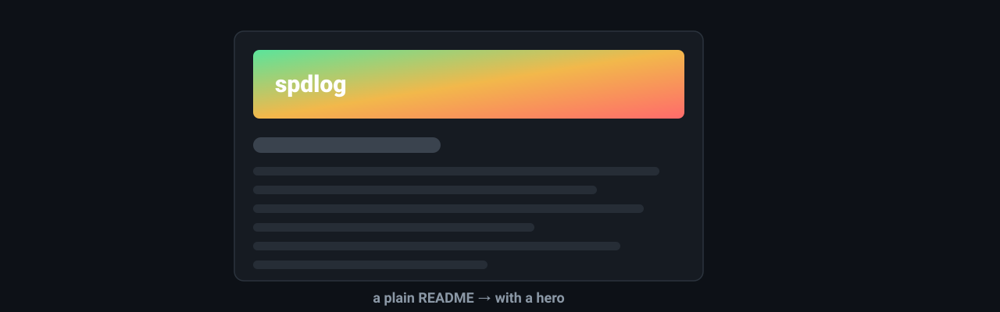&nbsp;&nbsp;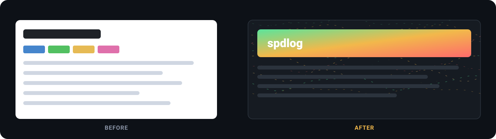

---

### [celery/celery](https://github.com/celery/celery) · ⭐ 29k · `Python`

Distributed task queue for Python


&nbsp;&nbsp;

---

### [sharkdp/hyperfine](https://github.com/sharkdp/hyperfine) · ⭐ 29k · `Rust`

A command-line benchmarking tool


&nbsp;&nbsp;

---

### [tj/commander.js](https://github.com/tj/commander.js) · ⭐ 28k · `JavaScript`

node.js command-line interfaces made easy


&nbsp;&nbsp;

---

### [caolan/async](https://github.com/caolan/async) · ⭐ 28k · `JavaScript`

Async utilities for node and the browser


&nbsp;&nbsp;

---

### [locustio/locust](https://github.com/locustio/locust) · ⭐ 28k · `Python`

Write scalable load tests in plain Python


&nbsp;&nbsp;

---

### [libuv/libuv](https://github.com/libuv/libuv) · ⭐ 27k · `C`

Multi-platform support library for asynchronous I/O


&nbsp;&nbsp;

---

### [remy/nodemon](https://github.com/remy/nodemon) · ⭐ 27k · `JavaScript`

Auto-restart your Node.js app on file changes


&nbsp;&nbsp;

---

### [charmbracelet/glow](https://github.com/charmbracelet/glow) · ⭐ 26k · `Go`

Render markdown on the CLI, with pizzazz! 💅


&nbsp;&nbsp;

---

### [stretchr/testify](https://github.com/stretchr/testify) · ⭐ 26k · `Go`

Common assertions and mocks for Go testing


&nbsp;&nbsp;

---

### [sirupsen/logrus](https://github.com/sirupsen/logrus) · ⭐ 26k · `Go`

Structured, pluggable logging for Go.

&nbsp;&nbsp;

---

### [asdf-vm/asdf](https://github.com/asdf-vm/asdf) · ⭐ 25k · `Go`

Manage multiple runtime versions with a single CLI


&nbsp;&nbsp;

---

### [tsenart/vegeta](https://github.com/tsenart/vegeta) · ⭐ 25k · `Go`

HTTP load testing tool and library. It's over 9000!


&nbsp;&nbsp;

---

### [pypa/pipenv](https://github.com/pypa/pipenv) · ⭐ 25k · `Python`

Python Development Workflow for Humans.


&nbsp;&nbsp;

---

### [cookiecutter/cookiecutter](https://github.com/cookiecutter/cookiecutter) · ⭐ 25k · `Python`

Create projects swiftly from cookiecutters (templates)


&nbsp;&nbsp;

---

### [winstonjs/winston](https://github.com/winstonjs/winston) · ⭐ 25k · `JavaScript`

A logger for just about everything.

&nbsp;&nbsp;

---

### [urfave/cli](https://github.com/urfave/cli) · ⭐ 24k · `Go`

Declarative, simple, fast CLI tools in Go


&nbsp;&nbsp;

---

### [Delgan/loguru](https://github.com/Delgan/loguru) · ⭐ 24k · `Python`

Python logging made (stupidly) simple

&nbsp;&nbsp;

---

### [fmtlib/fmt](https://github.com/fmtlib/fmt) · ⭐ 24k · `C++`

A fast, safe alternative to C stdio and C++ iostreams


&nbsp;&nbsp;

---

### [guzzle/guzzle](https://github.com/guzzle/guzzle) · ⭐ 23k · `PHP`

Guzzle, an extensible PHP HTTP client

&nbsp;&nbsp;

---

### [websockets/ws](https://github.com/websockets/ws) · ⭐ 23k · `JavaScript`

Blazing fast WebSocket client and server for Node.js


&nbsp;&nbsp;

---

### [eza-community/eza](https://github.com/eza-community/eza) · ⭐ 23k · `Rust`

A modern, maintained replacement for ls


&nbsp;&nbsp;

---

### [gitui-org/gitui](https://github.com/gitui-org/gitui) · ⭐ 22k · `Rust`

Blazing fast terminal-ui for git written in Rust

&nbsp;&nbsp;

---

### [rust-lang/mdBook](https://github.com/rust-lang/mdBook) · ⭐ 22k · `Rust`

Create modern books from Markdown, in Rust

&nbsp;&nbsp;

---

### [gorilla/mux](https://github.com/gorilla/mux) · ⭐ 22k · `Go`

A powerful HTTP router and URL matcher for Go

&nbsp;&nbsp;

---

### [catchorg/Catch2](https://github.com/catchorg/Catch2) · ⭐ 21k · `C++`

Modern, C++-native test framework — TDD &amp; BDD


&nbsp;&nbsp;

---

### [python/mypy](https://github.com/python/mypy) · ⭐ 21k · `Python`

Optional static typing for Python

&nbsp;&nbsp;

---

### [motdotla/dotenv](https://github.com/motdotla/dotenv) · ⭐ 20k · `JavaScript`

Loads environment variables from .env for nodejs projects


&nbsp;&nbsp;

---

### [sebastianbergmann/phpunit](https://github.com/sebastianbergmann/phpunit) · ⭐ 20k · `PHP`

The programmer-oriented testing framework for PHP


&nbsp;&nbsp;

---

### [fastapi/typer](https://github.com/fastapi/typer) · ⭐ 20k · `Python`

Build great CLIs. Based on Python type hints.


&nbsp;&nbsp;

---

### [so-fancy/diff-so-fancy](https://github.com/so-fancy/diff-so-fancy) · ⭐ 18k · `Perl`

Make your diffs human readable


&nbsp;&nbsp;

---

### [pallets/click](https://github.com/pallets/click) · ⭐ 18k · `Python`

Python composable command line interface toolkit

&nbsp;&nbsp;

---

### [denisidoro/navi](https://github.com/denisidoro/navi) · ⭐ 17k · `Rust`

An interactive cheatsheet tool for the command-line


&nbsp;&nbsp;

---

### [lsd-rs/lsd](https://github.com/lsd-rs/lsd) · ⭐ 16k · `Rust`

The next gen ls command


&nbsp;&nbsp;

---

### [mikefarah/yq](https://github.com/mikefarah/yq) · ⭐ 16k · `Go`

Portable command-line YAML, JSON &amp; XML processor

&nbsp;&nbsp;

---

### [encode/httpx](https://github.com/encode/httpx) · ⭐ 15k · `Python`

A next-generation HTTP client for Python.

&nbsp;&nbsp;

---

### [direnv/direnv](https://github.com/direnv/direnv) · ⭐ 15k · `Go`

Load and unload env vars per directory, via .envrc


&nbsp;&nbsp;

---

### [sindresorhus/got](https://github.com/sindresorhus/got) · ⭐ 15k · `TypeScript`

Human-friendly and powerful HTTP requests for Node.js


&nbsp;&nbsp;

---

### [XAMPPRocky/tokei](https://github.com/XAMPPRocky/tokei) · ⭐ 15k · `Rust`

Count your code, quickly.


&nbsp;&nbsp;

---

### [pytest-dev/pytest](https://github.com/pytest-dev/pytest) · ⭐ 14k · `Python`

Simple tests that scale to complex functional testing


&nbsp;&nbsp;

---

### [ClementTsang/bottom](https://github.com/ClementTsang/bottom) · ⭐ 14k · `Rust`

Cross-platform graphical process/system monitor


&nbsp;&nbsp;

---

### [tmuxinator/tmuxinator](https://github.com/tmuxinator/tmuxinator) · ⭐ 14k · `Ruby`

Manage complex tmux sessions easily

&nbsp;&nbsp;

---

### [orf/gping](https://github.com/orf/gping) · ⭐ 13k · `Rust`

Ping, but with a graph.


&nbsp;&nbsp;

---

### [Kludex/starlette](https://github.com/Kludex/starlette) · ⭐ 12k · `Python`

The little ASGI framework that shines.


&nbsp;&nbsp;

---

### [sinatra/sinatra](https://github.com/sinatra/sinatra) · ⭐ 12k · `Ruby`

Classy web-development dressed in a DSL


&nbsp;&nbsp;

---

### [sqlalchemy/sqlalchemy](https://github.com/sqlalchemy/sqlalchemy) · ⭐ 12k · `Python`

The Database Toolkit for Python


&nbsp;&nbsp;

---

### [bootandy/dust](https://github.com/bootandy/dust) · ⭐ 12k · `Rust`

A more intuitive version of du in rust


&nbsp;&nbsp;

---

### [imsnif/bandwhich](https://github.com/imsnif/bandwhich) · ⭐ 12k · `Rust`

Terminal bandwidth utilization tool


&nbsp;&nbsp;

---

### [yargs/yargs](https://github.com/yargs/yargs) · ⭐ 12k · `JavaScript`

Build interactive command line tools by parsing args

&nbsp;&nbsp;

---

### [debug-js/debug](https://github.com/debug-js/debug) · ⭐ 11k · `JavaScript`

A tiny JavaScript debugging utility

&nbsp;&nbsp;

---

### [boto/boto3](https://github.com/boto/boto3) · ⭐ 9.9k · `Python`

AWS SDK for Python — S3, EC2, DynamoDB and more


&nbsp;&nbsp;

---

### [symfony/console](https://github.com/symfony/console) · ⭐ 9.8k · `PHP`

Beautiful and testable command line interfaces

&nbsp;&nbsp;

---

### [sindresorhus/ora](https://github.com/sindresorhus/ora) · ⭐ 9.7k · `JavaScript`

Elegant terminal spinner

&nbsp;&nbsp;

---

### [dylanaraps/pywal](https://github.com/dylanaraps/pywal) · ⭐ 9.1k · `Python`

Generate and change color-schemes on the fly.


&nbsp;&nbsp;

---

### [node-fetch/node-fetch](https://github.com/node-fetch/node-fetch) · ⭐ 8.9k · `JavaScript`

A light-weight module bringing Fetch to Node.js


&nbsp;&nbsp;

---

### [isaacs/node-glob](https://github.com/isaacs/node-glob) · ⭐ 8.7k · `TypeScript`

Match files using the patterns the shell uses


&nbsp;&nbsp;

---

### [htop-dev/htop](https://github.com/htop-dev/htop) · ⭐ 8.2k · `C`

An interactive process viewer for the terminal


&nbsp;&nbsp;

---

### [sindresorhus/execa](https://github.com/sindresorhus/execa) · ⭐ 7.6k · `JavaScript`

Process execution for humans


&nbsp;&nbsp;

---

### [chmln/sd](https://github.com/chmln/sd) · ⭐ 7.3k · `Rust`

Intuitive find &amp; replace CLI (sed alternative)


&nbsp;&nbsp;

---

### [watchexec/watchexec](https://github.com/watchexec/watchexec) · ⭐ 7.1k · `Rust`

Executes commands in response to file modifications


&nbsp;&nbsp;

---

### [gopasspw/gopass](https://github.com/gopasspw/gopass) · ⭐ 7.1k · `Go`

Slightly more awesome UNIX password manager for teams

&nbsp;&nbsp;

---

### [PyCQA/isort](https://github.com/PyCQA/isort) · ⭐ 7.0k · `Python`

isort your imports, so you don't have to.


&nbsp;&nbsp;

---

### [ogham/dog](https://github.com/ogham/dog) · ⭐ 6.7k · `Rust`

A colourful command-line DNS client, like dig


&nbsp;&nbsp;

---

### [tealdeer-rs/tealdeer](https://github.com/tealdeer-rs/tealdeer) · ⭐ 6.4k · `Rust`

A very fast implementation of tldr in Rust.


&nbsp;&nbsp;

---

### [dalance/procs](https://github.com/dalance/procs) · ⭐ 6.1k · `Rust`

A modern replacement for ps written in Rust


&nbsp;&nbsp;

---

### [PyCQA/flake8](https://github.com/PyCQA/flake8) · ⭐ 3.8k · `Python`

Your tool for style guide enforcement

&nbsp;&nbsp;

---

### [babarot/enhancd](https://github.com/babarot/enhancd) · ⭐ 2.7k · `Shell`

A next-generation cd command with your interactive filter


&nbsp;&nbsp;

---

### [ruby/rake](https://github.com/ruby/rake) · ⭐ 2.5k · `Ruby`

A make-like build utility for Ruby.


&nbsp;&nbsp;

---

### [jmespath/jp](https://github.com/jmespath/jp) · ⭐ 787 · `Python`

Command line interface to JMESPath


&nbsp;&nbsp;

---

### [rspec/rspec](https://github.com/rspec/rspec) · ⭐ 110 · `Ruby`

Behavior-driven testing for Ruby


&nbsp;&nbsp;

---

