# hero-readme — in the wild

Wordmark heroes auto-generated for **103 popular repositories**, each built from the project's **real** name, description, and primary language (fetched live from GitHub). This is the skill's *safe-default* archetype — a wordmark over a language-colored flow-field — **not** a bespoke per-project motif like [codeaway](../examples/codeaway.svg). It shows the skill at scale.

> These are a demonstration of what `hero-readme` would generate; "popular repo without a hero" is best-effort curation. Generated from live GitHub metadata, July 2026. Sorted by stars.

---

**[Genymobile/scrcpy](https://github.com/Genymobile/scrcpy)** · ⭐ 146k · `C` — Display and control your Android device

---

**[axios/axios](https://github.com/axios/axios)** · ⭐ 109k · `JavaScript` — Promise based HTTP client for the browser and node.js

---

**[nvbn/thefuck](https://github.com/nvbn/thefuck)** · ⭐ 98k · `Python` — Magnificent app which corrects your previous console command.

---

**[junegunn/fzf](https://github.com/junegunn/fzf)** · ⭐ 82k · `Go` — A command-line fuzzy finder

---

**[jesseduffield/lazygit](https://github.com/jesseduffield/lazygit)** · ⭐ 81k · `Go` — simple terminal UI for git commands

---

**[BurntSushi/ripgrep](https://github.com/BurntSushi/ripgrep)** · ⭐ 66k · `Rust` — ripgrep recursively searches directories for a regex pattern while respecting your gitignore

---

**[tldr-pages/tldr](https://github.com/tldr-pages/tldr)** · ⭐ 63k · `Markdown` — Collaborative cheatsheets for console commands 📚.

---

**[lodash/lodash](https://github.com/lodash/lodash)** · ⭐ 61k · `JavaScript` — A modern JavaScript utility library delivering modularity, performance, &amp; extras.

---

**[sharkdp/bat](https://github.com/sharkdp/bat)** · ⭐ 60k · `Rust` — A cat(1) clone with wings.

---

**[starship/starship](https://github.com/starship/starship)** · ⭐ 59k · `Rust` — ☄🌌️ The minimal, blazing-fast, and infinitely customizable prompt for any shell!

---

**[wagoodman/dive](https://github.com/wagoodman/dive)** · ⭐ 54k · `Go` — A tool for exploring each layer in a docker image

---

**[psf/requests](https://github.com/psf/requests)** · ⭐ 54k · `Python` — A simple, yet elegant, HTTP library.

---

**[jesseduffield/lazydocker](https://github.com/jesseduffield/lazydocker)** · ⭐ 52k · `Go` — The lazier way to manage everything docker

---

**[nlohmann/json](https://github.com/nlohmann/json)** · ⭐ 50k · `C++` — JSON for Modern C++

---

**[tmux/tmux](https://github.com/tmux/tmux)** · ⭐ 48k · `C` — tmux source code

---

**[pyenv/pyenv](https://github.com/pyenv/pyenv)** · ⭐ 45k · `Shell` — Simple Python version management

---

**[spf13/cobra](https://github.com/spf13/cobra)** · ⭐ 44k · `Go` — A Commander for modern Go CLI interactions

---

**[sharkdp/fd](https://github.com/sharkdp/fd)** · ⭐ 44k · `Rust` — A simple, fast and user-friendly alternative to 'find'

---

**[curl/curl](https://github.com/curl/curl)** · ⭐ 42k · `C` — A command line tool and library for transferring data with URL syntax, supporting DICT, FILE, FTP, FTPS, GOPHER, GOPHERS, HTTP, HTTPS, IMAP, IMAPS, LDAP, LDAPS, MQTT, MQTTS, POP3, POP3S, RTSP, SCP, SFTP, SMB, SMBS, SMTP, SMTPS, TELNET, TFTP, WS and WSS. libcurl offers a myriad of powerful features

---

**[psf/black](https://github.com/psf/black)** · ⭐ 42k · `Python` — The uncompromising Python code formatter

---

**[koalaman/shellcheck](https://github.com/koalaman/shellcheck)** · ⭐ 40k · `Haskell` — ShellCheck, a static analysis tool for shell scripts

---

**[google/googletest](https://github.com/google/googletest)** · ⭐ 39k · `C++` — GoogleTest - Google Testing and Mocking Framework

---

**[ajeetdsouza/zoxide](https://github.com/ajeetdsouza/zoxide)** · ⭐ 38k · `Rust` — A smarter cd command. Supports all major shells.

---

**[date-fns/date-fns](https://github.com/date-fns/date-fns)** · ⭐ 37k · `TypeScript` — ⏳ Modern JavaScript date utility library ⌛️

---

**[koajs/koa](https://github.com/koajs/koa)** · ⭐ 36k · `JavaScript` — Expressive middleware for node.js using ES2017 async functions

---

**[jqlang/jq](https://github.com/jqlang/jq)** · ⭐ 35k · `C` — Command-line JSON processor

---

**[casey/just](https://github.com/casey/just)** · ⭐ 35k · `Rust` — 🤖 Just a command runner

---

**[python-poetry/poetry](https://github.com/python-poetry/poetry)** · ⭐ 34k · `Python` — Python packaging and dependency management made easy

---

**[derailed/k9s](https://github.com/derailed/k9s)** · ⭐ 34k · `Go` — 🐶 Kubernetes CLI To Manage Your Clusters In Style!

---

**[aristocratos/btop](https://github.com/aristocratos/btop)** · ⭐ 34k · `C++` — A monitor of resources

---

**[dandavison/delta](https://github.com/dandavison/delta)** · ⭐ 32k · `Rust` — A syntax-highlighting pager for git, diff, grep, rg --json, and blame output

---

**[tqdm/tqdm](https://github.com/tqdm/tqdm)** · ⭐ 31k · `Python` — A Fast, Extensible Progress Bar for Python and CLI

---

**[spf13/viper](https://github.com/spf13/viper)** · ⭐ 30k · `Go` — Go configuration with fangs

---

**[gabime/spdlog](https://github.com/gabime/spdlog)** · ⭐ 29k · `C++` — Fast C++ logging library.

---

**[celery/celery](https://github.com/celery/celery)** · ⭐ 29k · `Python` — Distributed Task Queue (development branch)

---

**[sharkdp/hyperfine](https://github.com/sharkdp/hyperfine)** · ⭐ 29k · `Rust` — A command-line benchmarking tool

---

**[tj/commander.js](https://github.com/tj/commander.js)** · ⭐ 28k · `JavaScript` — node.js command-line interfaces made easy

---

**[caolan/async](https://github.com/caolan/async)** · ⭐ 28k · `JavaScript` — Async utilities for node and the browser

---

**[locustio/locust](https://github.com/locustio/locust)** · ⭐ 28k · `Python` — Write scalable load tests in plain Python 🚗💨

---

**[libuv/libuv](https://github.com/libuv/libuv)** · ⭐ 27k · `C` — Cross-platform asynchronous I/O

---

**[remy/nodemon](https://github.com/remy/nodemon)** · ⭐ 27k · `JavaScript` — Monitor for any changes in your node.js application and automatically restart the server - perfect for development

---

**[charmbracelet/glow](https://github.com/charmbracelet/glow)** · ⭐ 26k · `Go` — Render markdown on the CLI, with pizzazz! 💅🏻

---

**[stretchr/testify](https://github.com/stretchr/testify)** · ⭐ 26k · `Go` — A toolkit with common assertions and mocks that plays nicely with the standard library

---

**[sirupsen/logrus](https://github.com/sirupsen/logrus)** · ⭐ 26k · `Go` — Structured, pluggable logging for Go.

---

**[asdf-vm/asdf](https://github.com/asdf-vm/asdf)** · ⭐ 25k · `Go` — Extendable version manager with support for Ruby, Node.js, Elixir, Erlang &amp; more

---

**[tsenart/vegeta](https://github.com/tsenart/vegeta)** · ⭐ 25k · `Go` — HTTP load testing tool and library. It's over 9000!

---

**[pypa/pipenv](https://github.com/pypa/pipenv)** · ⭐ 25k · `Python` — Python Development Workflow for Humans.

---

**[cookiecutter/cookiecutter](https://github.com/cookiecutter/cookiecutter)** · ⭐ 25k · `Python` — A cross-platform command-line utility that creates projects from cookiecutters (project templates), e.g. Python package projects, C projects.

---

**[winstonjs/winston](https://github.com/winstonjs/winston)** · ⭐ 25k · `JavaScript` — A logger for just about everything.

---

**[urfave/cli](https://github.com/urfave/cli)** · ⭐ 24k · `Go` — A declarative, simple, fast, and fun package for building command line tools in Go

---

**[Delgan/loguru](https://github.com/Delgan/loguru)** · ⭐ 24k · `Python` — Python logging made (stupidly) simple

---

**[fmtlib/fmt](https://github.com/fmtlib/fmt)** · ⭐ 24k · `C++` — A modern formatting library

---

**[guzzle/guzzle](https://github.com/guzzle/guzzle)** · ⭐ 23k · `PHP` — Guzzle, an extensible PHP HTTP client

---

**[websockets/ws](https://github.com/websockets/ws)** · ⭐ 23k · `JavaScript` — Simple to use, blazing fast and thoroughly tested WebSocket client and server for Node.js

---

**[eza-community/eza](https://github.com/eza-community/eza)** · ⭐ 23k · `Rust` — A modern alternative to ls

---

**[gitui-org/gitui](https://github.com/gitui-org/gitui)** · ⭐ 22k · `Rust` — Blazing 💥 fast terminal-ui for git written in rust 🦀

---

**[rust-lang/mdBook](https://github.com/rust-lang/mdBook)** · ⭐ 22k · `Rust` — Create book from markdown files. Like Gitbook but implemented in Rust

---

**[gorilla/mux](https://github.com/gorilla/mux)** · ⭐ 22k · `Go` — Package gorilla/mux is a powerful HTTP router and URL matcher for building Go web servers with 🦍

---

**[catchorg/Catch2](https://github.com/catchorg/Catch2)** · ⭐ 21k · `C++` — A modern, C++-native, test framework for unit-tests, TDD and BDD - using C++14, C++17 and later (C++11 support is in v2.x branch, and C++03 on the Catch1.x branch)

---

**[python/mypy](https://github.com/python/mypy)** · ⭐ 21k · `Python` — Optional static typing for Python

---

**[motdotla/dotenv](https://github.com/motdotla/dotenv)** · ⭐ 20k · `JavaScript` — Loads environment variables from .env for nodejs projects.

---

**[sebastianbergmann/phpunit](https://github.com/sebastianbergmann/phpunit)** · ⭐ 20k · `PHP` — The PHP Unit Testing framework.

---

**[fastapi/typer](https://github.com/fastapi/typer)** · ⭐ 20k · `Python` — Typer, build great CLIs. Easy to code. Based on Python type hints.

---

**[so-fancy/diff-so-fancy](https://github.com/so-fancy/diff-so-fancy)** · ⭐ 18k · `Perl` — Make your diffs human readable for improved code quality and faster defect detection.

---

**[pallets/click](https://github.com/pallets/click)** · ⭐ 18k · `Python` — Python composable command line interface toolkit

---

**[denisidoro/navi](https://github.com/denisidoro/navi)** · ⭐ 17k · `Rust` — An interactive cheatsheet tool for the command-line

---

**[lsd-rs/lsd](https://github.com/lsd-rs/lsd)** · ⭐ 16k · `Rust` — The next gen ls command

---

**[mikefarah/yq](https://github.com/mikefarah/yq)** · ⭐ 16k · `Go` — yq is a portable command-line YAML, JSON, XML, CSV, TOML, HCL and properties processor

---

**[encode/httpx](https://github.com/encode/httpx)** · ⭐ 15k · `Python` — A next generation HTTP client for Python. 🦋

---

**[direnv/direnv](https://github.com/direnv/direnv)** · ⭐ 15k · `Go` — unclutter your .profile

---

**[sindresorhus/got](https://github.com/sindresorhus/got)** · ⭐ 15k · `TypeScript` — 🌐 Human-friendly and powerful HTTP request library for Node.js

---

**[XAMPPRocky/tokei](https://github.com/XAMPPRocky/tokei)** · ⭐ 15k · `Rust` — Count your code, quickly.

---

**[pytest-dev/pytest](https://github.com/pytest-dev/pytest)** · ⭐ 14k · `Python` — The pytest framework makes it easy to write small tests, yet scales to support complex functional testing

---

**[ClementTsang/bottom](https://github.com/ClementTsang/bottom)** · ⭐ 14k · `Rust` — Yet another cross-platform graphical process/system monitor.

---

**[tmuxinator/tmuxinator](https://github.com/tmuxinator/tmuxinator)** · ⭐ 14k · `Ruby` — Manage complex tmux sessions easily

---

**[orf/gping](https://github.com/orf/gping)** · ⭐ 13k · `Rust` — Ping, but with a graph

---

**[Kludex/starlette](https://github.com/Kludex/starlette)** · ⭐ 12k · `Python` — The little ASGI framework that shines. 🌟

---

**[sinatra/sinatra](https://github.com/sinatra/sinatra)** · ⭐ 12k · `Ruby` — Classy web-development dressed in a DSL (official / canonical repo)

---

**[sqlalchemy/sqlalchemy](https://github.com/sqlalchemy/sqlalchemy)** · ⭐ 12k · `Python` — The Database Toolkit for Python

---

**[bootandy/dust](https://github.com/bootandy/dust)** · ⭐ 12k · `Rust` — A more intuitive version of du in rust

---

**[imsnif/bandwhich](https://github.com/imsnif/bandwhich)** · ⭐ 12k · `Rust` — Terminal bandwidth utilization tool

---

**[yargs/yargs](https://github.com/yargs/yargs)** · ⭐ 12k · `JavaScript` — yargs the modern, pirate-themed successor to optimist.

---

**[debug-js/debug](https://github.com/debug-js/debug)** · ⭐ 11k · `JavaScript` — A tiny JavaScript debugging utility modelled after Node.js core's debugging technique. Works in Node.js and web browsers

---

**[boto/boto3](https://github.com/boto/boto3)** · ⭐ 9.9k · `Python` — Boto3, an AWS SDK for Python

---

**[symfony/console](https://github.com/symfony/console)** · ⭐ 9.8k · `PHP` — Eases the creation of beautiful and testable command line interfaces

---

**[sindresorhus/ora](https://github.com/sindresorhus/ora)** · ⭐ 9.7k · `JavaScript` — Elegant terminal spinner

---

**[dylanaraps/pywal](https://github.com/dylanaraps/pywal)** · ⭐ 9.1k · `Python` — 🎨 Generate and change color-schemes on the fly.

---

**[node-fetch/node-fetch](https://github.com/node-fetch/node-fetch)** · ⭐ 8.9k · `JavaScript` — A light-weight module that brings the Fetch API to Node.js

---

**[isaacs/node-glob](https://github.com/isaacs/node-glob)** · ⭐ 8.7k · `TypeScript` — glob functionality for node.js

---

**[htop-dev/htop](https://github.com/htop-dev/htop)** · ⭐ 8.2k · `C` — htop - an interactive process viewer

---

**[sindresorhus/execa](https://github.com/sindresorhus/execa)** · ⭐ 7.6k · `JavaScript` — Process execution for humans

---

**[chmln/sd](https://github.com/chmln/sd)** · ⭐ 7.3k · `Rust` — Intuitive find &amp; replace CLI (sed alternative)

---

**[watchexec/watchexec](https://github.com/watchexec/watchexec)** · ⭐ 7.1k · `Rust` — Executes commands in response to file modifications

---

**[gopasspw/gopass](https://github.com/gopasspw/gopass)** · ⭐ 7.1k · `Go` — The slightly more awesome standard unix password manager for teams

---

**[PyCQA/isort](https://github.com/PyCQA/isort)** · ⭐ 7.0k · `Python` — A Python utility / library to sort imports.

---

**[ogham/dog](https://github.com/ogham/dog)** · ⭐ 6.7k · `Rust` — A command-line DNS client.

---

**[tealdeer-rs/tealdeer](https://github.com/tealdeer-rs/tealdeer)** · ⭐ 6.4k · `Rust` — A very fast implementation of tldr in Rust.

---

**[dalance/procs](https://github.com/dalance/procs)** · ⭐ 6.1k · `Rust` — A modern replacement for ps written in Rust

---

**[PyCQA/flake8](https://github.com/PyCQA/flake8)** · ⭐ 3.8k · `Python` — flake8 is a python tool that glues together pycodestyle, pyflakes, mccabe, and third-party plugins to check the style and quality of some python code.

---

**[babarot/enhancd](https://github.com/babarot/enhancd)** · ⭐ 2.7k · `Shell` — A next-generation cd command with your interactive filter

---

**[ruby/rake](https://github.com/ruby/rake)** · ⭐ 2.5k · `Ruby` — A make-like build utility for Ruby.

---

**[jmespath/jp](https://github.com/jmespath/jp)** · ⭐ 787 · `Python` — Command line interface to JMESPath - http://jmespath.org

---

**[rspec/rspec](https://github.com/rspec/rspec)** · ⭐ 110 · `Ruby` — The RSpec monorepo

---

