# hero-readme — concept lab 🧪

A library of **default marketing motifs** — reusable, always-works ways to show off
a hero. Each is one self-contained animated SVG (pure CSS/SMIL, no `<script>`) that
loops right here on GitHub, and each is **parameterizable per project** (swap the
palette + concept and it fits any repo). These are ideas to react to — tell me which
should graduate into the skill and/or the main README.

> Motion loops; with "reduce motion" on, each shows its finished frame.

## Reveals

**1. Before → After** — a plain, boring README suddenly gains a hero at the top; the
content shifts down to make room. The single clearest "why you want this."

**2. Generic → authentic** — a muddy, meaningless *generic AI-art* blob wipes away to
reveal a hero built from the real project. This is hero-readme's whole thesis in one loop.

**3. Spotlight scan** — a spotlight sweeps across a dim hero, lighting it up as it
passes, as if the tool is reading the repo and revealing what's there.

**4. Boot-up** — the hero assembles itself: the background ignites, the wordmark rises
into place, and the band materializes before a shimmer runs across it.

## Type-ins

**5. Terminal cast** — a terminal runs the command and the generated hero drops in as
its output. Speaks straight to developers.

**6. Typewriter** — the wordmark types itself in, character by character, with a
blinking caret, then the tagline settles in.

## Transforms

**7. Badge morph** — a lifeless row of shields.io badges collapses and a real hero
grows in its place. "More than a badge strip."

**8. Theme flip** — one hero recoloring through several palettes (cycling the actual
Odysseus / Void / Abyss / Ember themes). Shows the palette is derived, not fixed.

## Comparison

**9. Side-by-side** — a shields-only README next to one with a real hero. No animation
needed to make the point, though the hero side still breathes.

---

### Notes / next

- Any of these can become a section in the main README (**Before → After** is the
  natural opener) or a reusable motif the skill emits on request.
- Per-repo, each is recolored to the project's brand and re-themed to its concept —
  see the plan to apply **Before → After**, **Boot-up**, and **Side-by-side**
  uniquely to every repo in the [wild gallery](assets/wild/wild.md).
